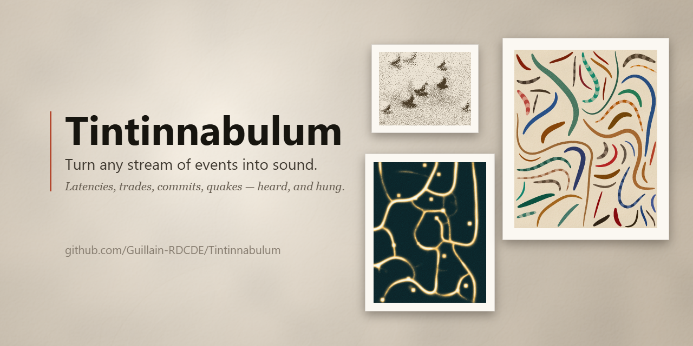
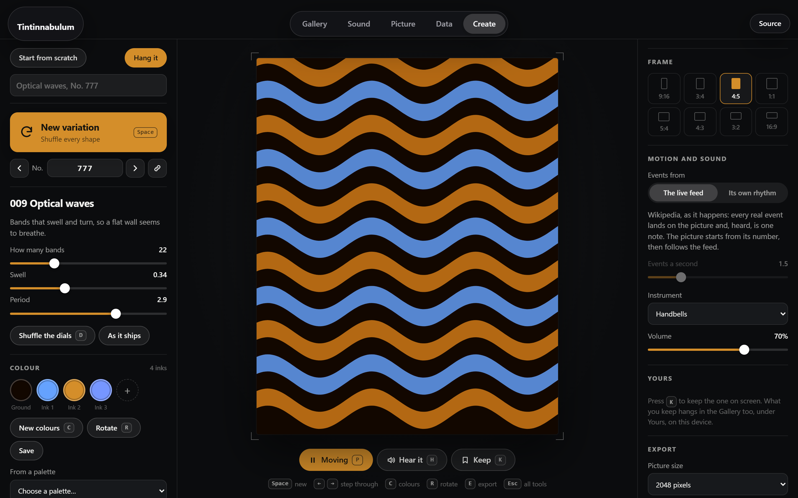

  

# Tintinnabulum

<!-- opening -->
> Every event in a live system becomes a note and a shape. You hear production instead of watching it.
>
> Zero-dependency JavaScript: server-sent events in, Web Audio and canvas out; runs in any browser, on a phone, with your own feed plugged in by one curl.
>
> Observability people actually use, built from nothing but the browser. Part of the work of [Guillain d’Erceville](https://github.com/Guillain-RDCDE), forward deployed engineer.
<!-- opening -->

**Hear your data.**

Something happens. You hear a note.

Big things sound low. Small things sound high. Things that grow ring. Things
that shrink are plucked.

That is the whole idea.

**[Open the sandbox →](https://guillain-rdcde.github.io/Tintinnabulum/)**

Press **Listen**. You are listening to Wikipedia: every circle is somebody
editing an article, somewhere, at that moment. Click one to open it.

Eleven other feeds are in the same list. You can send your own with one `curl`.
Nothing to install; it runs in a browser, and on a phone.

Or open **Create**, the fifth tab: every picture is a small tool. Press
**Space** for another, change the colours, hear it, keep the ones you like,
take them away as a picture or a video with its sound, or hang them on the
wall. Some are drawn as a hand would draw them: pencil that skips on the grain,
watercolour that runs and dries darker at its edge, pen-and-ink hatching. Any
work in the Gallery has a **Remix** that opens it there, and what you hang comes
back to the Gallery, in a room of your own.

  

<i>Optical waves</i>, variation 777, on the Create bench. Each event swells a band.

> *tintinnabulum* — Latin, a small bell.

## More

- **[How it works](docs/HOW-IT-WORKS.md)** — the whole path, from the feed to
  the speaker, in plain language first.
- **[The input standard](spec/README.md)** — one required field, and a mapping
  document that plugs anything else in without writing code.
- **[Reference](docs/REFERENCE.md)** — the library API, the built-in feeds,
  the kits, the scenes, the palettes, the finishes and the works.

## Thanks

**[Stéphanie Cante](https://www.linkedin.com/in/st%C3%A9phanie-cante-1a461374)**,
who put Listen to Wikipedia in front of me, explained what made it good, and
said this had to exist.

---

The idea — a bell for growth, a plucked string for shrinkage, pitch inversely proportional to the size of the change — comes from <a href="https://github.com/hatnote/listen-to-wikipedia">Listen to Wikipedia</a> by Stephen LaPorte and Mahmoud Hashemi, and through it from <a href="https://www.bitlisten.com/">BitListen</a> by Maximillian Laumeister. The sample banks in <code>sounds/</code> are redistributed from that project under its BSD 3-Clause licence. Pencil, ink and watercolour are drawn by a port of <a href="https://github.com/acamposuribe/p5.brush">p5.brush</a> by Alejandro Campos Uribe, mixing colours after <a href="https://github.com/rvanwijnen/spectral.js">spectral.js</a> by Ronald van Wijnen, both MIT. Tintinnabulum is an independent implementation, not a fork, and is not endorsed by any of the above — see <a href="NOTICE">NOTICE</a>, and use <code>kit: 'synth'</code> to ship no third-party audio at all. BSD 3-Clause, see <a href="LICENSE">LICENSE</a>.
